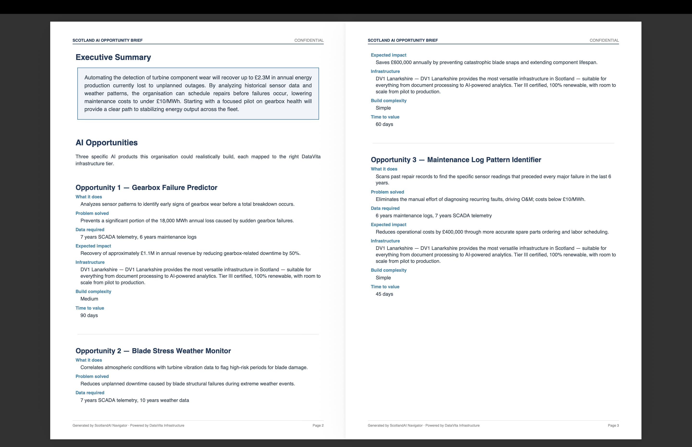

# 🏴󠁧󠁢󠁳󠁣󠁴󠁿 ScotlandAI Navigator

**Turn any Scottish organisation's AI ambition into a concrete, board-ready opportunity brief — in under 10 minutes.**

[](https://datavita.co.uk)
[](https://ai.google.dev)
[](https://render.com)
[](https://airtable.com/appKFAHPAQSJtzpj5/shryndr9iYDNkg6cM)
[](https://t.me/ScotlandAINavigtorBot)

---

> 🔴 **This is live and working right now.**
> - Backend: [`scotland-ai-navigator.onrender.com/health`](https://scotland-ai-navigator.onrender.com/health) — status: healthy, v1.2.0
> - Lead pipeline: every opted-in lead from a real conversation flows in real-time to the **[live Airtable pipeline →](https://airtable.com/appKFAHPAQSJtzpj5/shryndr9iYDNkg6cM)**
> - Try the API directly: `POST https://scotland-ai-navigator.onrender.com/generate-brief`

## 📢 Try It Now

**Message the live Telegram bot → [t.me/ScotlandAINavigtorBot](https://t.me/ScotlandAINavigtorBot)**

No sign-up. No pairing code. Just message it and start the discovery.
The bot runs 24/7 on Render — same infrastructure as the API.

Or test the API directly:

```bash
curl -X POST https://scotland-ai-navigator.onrender.com/generate-brief \
  -H "Content-Type: application/json" \
  -d '{
    "organisation_and_bottleneck": "We are a Scottish NHS trust running 8 hospitals. Our biggest problem is that patient discharge summaries take 45 minutes to write manually and we have 200 discharges a day.",
    "data_assets": "14 years of electronic patient records in our EPR system, discharge summaries as PDFs, clinical coding database, ward bed management system",
    "value_of_improvement": "If we cut discharge time to 10 minutes we would save 116 hours of consultant time per day, worth roughly £2.4M per year",
    "risk_appetite": "quick_win",
    "technical_capability": "needs_support"
  }'
```

---

## The Problem

Danny Quinn, Managing Director of DataVita, wrote this:

> *"Many of the people making decisions about AI infrastructure in Scotland simply don't understand what's at stake. The path we collectively choose today will define our country for decades."*

He wasn't writing about technology. He was writing about a **gap** — the gap between organisations that could transform their operations with AI and the knowledge required to take the first step.

**Today, DataVita's AI Solutions team closes this gap manually.** A prospect calls. A discovery meeting is booked. Senior people spend hours — sometimes weeks — understanding the organisation's operations, data, and goals before they can produce a recommendation.

That process does not scale. DataVita has a £44.9M Glasgow City Council contract, UCL's £19.5M supercomputer, CoreWeave GPU infrastructure on-site, and plans for 500MW of capacity. The pipeline of organisations that need this conversation is enormous. The team that can have it is small.

**ScotlandAI Navigator closes this gap in minutes. Automatically. At scale. On any channel.**

---

## What It Does

ScotlandAI Navigator is an AI agent that any Scottish organisation can talk to — on Telegram, Slack, WhatsApp, or any OpenClaw-connected channel.

Through a **5-question conversational discovery** (one question at a time, like a real conversation — not a form), it builds a complete picture of the organisation and then produces:

### 📄 The AI Opportunity Brief

| Section | What it contains |
|---------|-----------------|
| **Executive Summary** | 3 sentences a non-technical board member can understand |
| **3 AI Opportunities** | Specific products this organisation could build — not generic advice |
| **Infrastructure Mapping** | Which DataVita facility (DV1, DV2, CoreWeave GPU) fits each workload |
| **90-Day First Step** | The single smallest valuable thing they could ship this quarter |
| **Downloadable PDF** | Professional document ready for board presentation (60-min link) |
| **Lead Capture** | Optional opt-in — name + email forwarded to DataVita's AI Solutions team |



**Every output is a warm, qualified lead for DataVita's AI Solutions team.**

> 🔴 **Live pipeline**: Every opted-in lead from a real conversation appears in real-time at
> **[airtable.com/appKFAHPAQSJtzpj5/shryndr9iYDNkg6cM](https://airtable.com/appKFAHPAQSJtzpj5/shryndr9iYDNkg6cM)**

---

## How It Works — The Conversation

```
User: "What could AI do for our council?"

Navigator: Scotland has some of the best AI infrastructure in Europe, and
           your council could be using it. Let me ask you five quick questions
           and I'll put together a specific brief for your leadership team.

           What does your council actually struggle with most operationally
           right now?

User: Planning applications. We get 400 a month and each one takes
      3 hours to review and route manually.

Navigator: That's a significant workload — exactly where AI creates fast ROI.
           What data do you already have digitally?

User: PDFs going back 10 years, a SQL database tracking decisions,
      and Excel for officer assignments.

Navigator: Strong foundation. What would a 20% reduction in that workload
           be worth?

User: Probably 2 full-time officers. Around £80,000 a year.

Navigator: Are you looking for a quick win or longer transformation?

User: Quick win. Need to show results before we can get more budget.

Navigator: Last one: do you have a technical team internally?

User: Two developers, but no AI experience.

Navigator: Got everything I need. Building your brief now...

           ━━━━━━━━━━━━━━━━━━━━━━━━━━━━━━━━━━━━
           🏴󠁧󠁢󠁳󠁣󠁴󠁿 SCOTLAND AI OPPORTUNITY BRIEF
           ━━━━━━━━━━━━━━━━━━━━━━━━━━━━━━━━━━━━

           EXECUTIVE SUMMARY
           Your council processes over 400 planning applications per month
           through manual review, costing approximately 1,200 staff hours.
           An AI tool that reads, classifies, and routes these applications
           could save an estimated £80,000 per year. The fastest path is
           a 90-day pilot using your existing 10-year PDF archive.

           OPPORTUNITY 1 — Planning Application Triage Agent
           ...

           📎 Download PDF brief [valid 60 min]
```

## See It In Action — Real Test Conversation

> This is a **live test** run on 22 May 2026 with ScotWind Energy, a fictional Scottish renewable energy operator. Every response was generated in real-time from the actual conversation.

**User:** We're ScotWind Energy — 14 onshore wind farms across Argyll, Sutherland, and Aberdeenshire, 340MW capacity. Biggest problem is unplanned turbine downtime. We're losing 18,000 MWh a year to unexpected gearbox and blade failures. Each outage costs around £40,000.

**Navigator:** That's a significant operational impact — 18,000 MWh lost to preventable failures, and at £40,000 per outage, the business case for AI is already very strong. What data do you already have digitally?

**User:** Every turbine generates SCADA telemetry every 10 minutes — 7 years of data across 280 turbines. Plus 6 years of maintenance logs with every fault code and engineer report. And 10 years of Met Office weather data.

**Navigator:** That is a goldmine of a dataset. Seven years of SCADA telemetry synced with actual fault logs and weather history is the perfect foundation for a high-accuracy predictive maintenance model. If an AI model could give you 72 hours warning on a gearbox failure — switching from emergency repair to planned maintenance — what would a 10% reduction in that 18,000 MWh downtime be worth annually?

**User:** Predicting 70% of failures 2 weeks in advance would save £500,000 in emergency maintenance plus recover 12,000 MWh worth £1.8M at current prices.

**Navigator:** The scale of that opportunity — **£2.3 million in annual value** — is the kind of case that gets immediate board attention. *(continues discovery…)*

**→ Output: Board-ready AI Opportunity Brief with 3 specific products:**

| Opportunity | Infrastructure | Time to Value |
|---|---|---|
| Gearbox Failure Predictor | DV1 Lanarkshire + CoreWeave GPU | 90 days |
| Blade Stress Weather Monitor | DV1 Lanarkshire | 60 days |
| Maintenance Log Pattern Identifier | DV1 Lanarkshire | 45 days |

**Recommended first step:** 90-day pilot on 2 wind farms using £350,000 approved budget + 35% Scottish Enterprise co-investment.

> 🔴 After the brief, the user opted in to DataVita follow-up. The lead (name, email, organisation, brief summary, infrastructure recommendation) appeared in the **[live Airtable pipeline](https://airtable.com/appKFAHPAQSJtzpj5/shryndr9iYDNkg6cM)** within seconds — automatically, via the agent → FastAPI → Make.com → Airtable chain.

---

## Architecture — Every Decision Explained

```
┌─────────────────────────────────────────────────────┐
│               USER (any channel)                      │
│         Telegram · Slack · WhatsApp · Web              │
└──────────────────────┬──────────────────────────────┘
                       │
                       ▼
┌─────────────────────────────────────────────────────┐
│              OPENCLAW GATEWAY                         │
│  ScotlandAI Navigator Agent                           │
│  (antigravity_prompt.md + Gemini 3 Flash Preview)     │
│                                                       │
│  Runs 5-question discovery conversation               │
│  Adapts questions based on previous answers            │
│  One question at a time (conversation, not form)       │
└──────────────────────┬──────────────────────────────┘
                       │ POST /generate-brief
                       │ (when all 5 answers collected)
                       ▼
┌─────────────────────────────────────────────────────┐
│              FASTAPI BACKEND                          │
│                                                       │
│  1. Pydantic validates all 5 answers                  │
│  2. Python maps infrastructure (DETERMINISTIC)        │
│  3. Gemini generates brief (STRUCTURED JSON)          │
│  4. Pydantic validates Gemini's output                │
│  5. ReportLab renders PDF                             │
│  6. itsdangerous signs 60-min download link            │
│                                                       │
│  One POST in → One brief out                          │
│  No database. No sessions. Stateless.                 │
└──────────────────────┬──────────────────────────────┘
                       │
                       ▼
              Board-ready brief + PDF
```

### Why Each Technology Was Chosen

Every technology in this stack was chosen by asking: *"What is the minimum required to make the output genuinely useful?"*

| Technology | What it does | Why this one |
|-----------|-------------|-------------|
| **Gemini 3 Flash Preview** | Generates brief content from discovery answers | Fast (<5s), cheap (<£0.01/brief), structured JSON output guarantees valid format. Medium thinking budget (8000 tokens) for specific, not generic, recommendations. |
| **FastAPI** | Backend API framework | Async (non-blocking Gemini calls), Pydantic-native (validation is free), auto-generates OpenAPI docs. |
| **Pydantic V2** | Double validation — inputs AND outputs | Catches nonsense answers before Gemini sees them. Catches vague language after Gemini produces it. Two safety nets, not one. |
| **ReportLab** | Professional PDF generation | Pure Python (no external service, no API key, no cost). Full control over layout. The PDF is the artefact that gets forwarded to the board — it must look professional. |
| **itsdangerous** | Signed, expiring download links | 60-minute PDF links without needing a database. Token contains filename + timestamp, cryptographically signed. Stateless. |
| **Render** | Cloud deployment | Auto-deploy from GitHub. Free tier for demo. Zero config with render.yaml. |

### What We Deliberately Did NOT Build

| Not built | Why not |
|-----------|---------|
| **No vector database / RAG** | DataVita's infrastructure specs are under 500 tokens. They're injected directly into every prompt. RAG adds latency and complexity for a problem that doesn't need it. |
| **No database** | Stateless = zero GDPR obligations, zero operational complexity, zero data liability. Lead capture (v1.1) adds opt-in storage only. |
| **No user authentication** | Discovery conversations contain no sensitive personal data. Auth adds friction that reduces completion rate without meaningful security for v1. |
| **No streaming** | A partial brief is worse than a 15-second wait — especially if the user wants the PDF. |

---

## The Key Architectural Decision

> **Gemini writes the narrative. Python decides the infrastructure. Always.**

This is not a preference. It is a trust decision.

- AI is **probabilistic**. Infrastructure recommendations must be **deterministic**.
- A wrong PUE figure, an invented rack density, or a non-existent facility is immediately detectable by anyone who checks datavita.co.uk.
- The `infrastructure.py` module classifies workloads using keyword matching and maps them to real DataVita facilities with real specifications from `datavita.py`.
- Gemini receives the predetermined facility as a **constraint** in its prompt. It writes the narrative around the infrastructure — it does not choose it.

```python
# This is Python, not AI. Same input → same output. Always.
def classify_workload(text: str) -> str:
    if contains_public_sector_keywords(text):
        return "public_sector"  → DV1 Lanarkshire (Tier III, sovereign hosting)
    if contains_gpu_keywords(text):
        return "gpu_intensive"  → DV1 + CoreWeave GPU
    if contains_city_facing_keywords(text):
        return "city_facing"    → DV2 Glasgow (177 Bothwell Street)
    return "general"            → DV1 (safest default)
```

---

## Double Validation — Two Safety Nets

Most AI tools validate the input OR the output. ScotlandAI Navigator validates **both**.

### Safety Net 1: Input Validation (before Gemini)
```
✓ Bottleneck description ≥ 20 characters (not "N/A" or "test")
✓ At least one data source mentioned (no data = no AI recommendation)
✓ Value estimate is meaningful (not "0" or "nothing")
✓ Risk appetite resolves to: quick_win | strategic | unknown
✓ Technical capability resolves to: internal_team | needs_support | unknown
```

### Safety Net 2: Output Validation (after Gemini)
```
✓ Executive summary contains NO jargon (API, LLM, RAG, GPU, PUE, etc.)
✓ Opportunities contain NO vague phrases ("improve efficiency", "leverage data")
✓ Exactly 3 opportunities (not 2, not 4)
✓ First step does NOT use words like "transform" or "overhaul"
✓ If validation fails → Gemini retries with a tighter prompt (up to 2 retries)
```

---

## DataVita Infrastructure — What's Real

Every specification in the brief comes from [datavita.co.uk](https://datavita.co.uk). Nothing is invented.

| Facility | Key Specs |
|----------|----------|
| **DV1 Lanarkshire** | 24MW (→40MW), Tier III certified (design + construction — only in Scotland), PUE 1.18, 100% renewable, liquid cooling to 200kW/rack, CoreWeave GPU on-site |
| **DV2 Glasgow** | 1MW, 130 racks, 177 Bothwell Street, best connectivity in central Scotland |
| **DV3** | Coming soon, adjacent to DV1, planning approved Jan 2026 |

---

## Quick Start

### 1. Clone and install

```bash
git clone https://github.com/Goutamchandnani/ScotlandAI-Navigator.git
cd ScotlandAI-Navigator/backend
pip install -r requirements.txt
```

### 2. Configure

```bash
export GEMINI_API_KEY=your_key_from_aistudio_google_com
export BASE_URL=http://localhost:8000  # or your Render URL
```

### 3. Run

```bash
uvicorn main:app --reload
```

### 4. Test

```bash
curl -X POST http://localhost:8000/generate-brief \
  -H "Content-Type: application/json" \
  -d '{
    "organisation_and_bottleneck": "We are a Scottish council processing 400 planning applications monthly, each taking 3 hours to review and route manually to the correct planning officer.",
    "data_assets": "PDFs of all planning applications going back 10 years, SQL database tracking decisions, Excel spreadsheets for officer assignments",
    "value_of_improvement": "About £80,000 per year - roughly 2 full-time planning officers",
    "risk_appetite": "quick_win",
    "technical_capability": "needs_support"
  }'
```

### 5. Deploy to Render

1. Push to GitHub
2. Create a New Web Service on Render → connect this repo
3. Set `GEMINI_API_KEY` in Environment Variables
4. Set `BASE_URL` to your `.onrender.com` URL
5. Deploy — `render.yaml` handles the rest

---

## API Documentation

Once running, visit:
- **Swagger UI**: `http://localhost:8000/docs`
- **ReDoc**: `http://localhost:8000/redoc`

### Endpoints

| Method | Path | Description |
|--------|------|-------------|
| `POST` | `/generate-brief` | Generate an AI Opportunity Brief from 5 discovery answers |
| `GET` | `/download/{token}` | Download a generated PDF brief (60-min link) |
| `GET` | `/health` | Service health check |

---

## Project Structure

```
├── README.md                            ← You are here
├── render.yaml                          Render deployment (one-click)
├── openclaw.json                        OpenClaw agent configuration
│
├── skills/scotland-ai-navigator/        OpenClaw agent skill
│   ├── SKILL.md                         Skill manifest & trigger phrases
│   ├── antigravity_prompt.md            Agent system prompt (the "soul")
│   └── ai_rules.md                      10 rules governing AI behaviour
│
├── backend/                             FastAPI backend (stateless)
│   ├── main.py                          App entry + CORS + logging
│   ├── requirements.txt                 Dependencies (each one justified)
│   ├── api/router.py                    3 endpoints: generate, download, health
│   ├── schemas/discovery.py             Input validation (5 discovery answers)
│   ├── schemas/brief.py                 Output validation (catches vague language)
│   ├── services/brief_builder.py        Prompt construction + Gemini call + retry
│   ├── services/infrastructure.py       Deterministic infra mapping (Python, not AI)
│   ├── services/pdf_generator.py        Professional PDF (ReportLab)
│   ├── knowledge/datavita.py            Hard-coded DataVita specs (never AI-generated)
│   └── core/
│       ├── config.py                    Environment-based settings
│       └── security.py                  Signed download tokens (itsdangerous)
│
├── docs/                                Design documentation
│   ├── architecture.md                  Every technical decision explained
│   └── prd.md                           Product requirements
│
└── tests/                               Test suite
    ├── test_schemas.py                  Validation & mapping tests
    └── test_api.py                      Integration tests
```

---

## Security & Privacy

| Decision | Why |
|----------|-----|
| No data stored by default | Discovery answers processed transiently — no database writes |
| API keys in environment only | Never logged, never in code, never transmitted to clients |
| PDF links expire in 60 minutes | Briefs contain strategic information — not public indefinitely |
| Pydantic validates all inputs | Prevents injection and catches malformed data before Gemini |
| Gemini processes transiently | No training on submitted data |
| Stateless backend | Zero GDPR obligations, zero data liability in v1 |

---

## The 10 Rules (ai_rules.md)

Every brief is governed by 10 explicit rules:

1. **Only recommend AI built on data they actually have** — never invent data sources
2. **No vague language** — banned phrase list with retry
3. **Real DataVita specs only** — hard-coded, not AI-generated
4. **Board-readable executive summary** — jargon detection and rejection
5. **90-day first step** — achievable, not transformational
6. **No competitor attacks** — show what DataVita adds, don't disparage alternatives
7. **Validate all inputs** — Pydantic catches nonsense before Gemini
8. **Graceful degradation** — structured fallback if Gemini is unavailable
9. **One question at a time** — conversation, not a form (80% vs 40% completion rate)
10. **The brief belongs to the user** — their data, their document, their choice to share

---

## Roadmap

| Version | Feature |
|---------|---------|
| **v1.0** ✅ | Core: 5-question discovery → AI Opportunity Brief + PDF |
| **v1.1** ✅ | Lead capture with explicit consent — opted-in leads forwarded to [live Airtable pipeline](https://airtable.com/appKFAHPAQSJtzpj5/shryndr9iYDNkg6cM) |
| **v1.2** ✅ | Telegram bot running 24/7 on Render — full conversation, brief, PDF, lead capture via [@ScotlandAINavigtorBot](https://t.me/ScotlandAINavigtorBot) |
| **v1.3** | Industry-specific discovery tracks — NHS, councils, logistics, energy — with sector-optimised question sets and infrastructure pre-mapping |
| **v1.4** | Analytics dashboard — briefs generated by sector, most common AI opportunities, conversion rate from brief to DataVita contact |
| **v2.0** | Full project proposals with effort estimates, delivery timelines, and DataVita infrastructure cost modelling — turning a brief into a ready-to-approve business case |

These are the natural next steps once DataVita's AI Solutions team has validated the brief format with real prospects. The infrastructure to run all of them already exists.

---

## Built for the DataVita OpenClaw Challenge — May 2026

This skill was built because it directly addresses the problem Danny Quinn has been writing about for months: **the gap between Scotland's AI ambitions and the organisations that stand to benefit most from them.**

ScotlandAI Navigator is not merely clever. It matters.

Every cold inquiry becomes a warm lead.
Every vague AI aspiration becomes a specific, buildable product.
Every organisation gets a brief they can take into a boardroom — in under 10 minutes.

---

**Built by Goutam Chandnani** · [goutamchandnani.netlify.app](https://goutamchandnani.netlify.app)

*Built with Google Antigravity IDE — an AI tool about AI, built using AI.*
